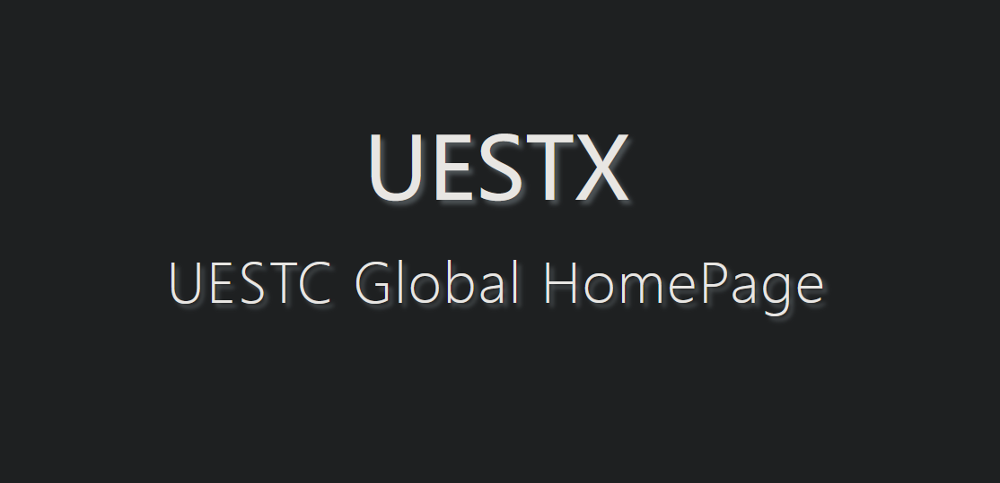

<h1 align="center"> UESTX </h1>

## The polymerization of all frequently-used UESTC online services.
## 电子科技大学 线上服务集合索引

### Target: Include all the online services, including Wechat Applets
### 目标任务：聚合所有线上服务，包括对微信小程序服务的拉起（暂时没想到怎么实现）

本项目已经通过 Github Pages 托管，您可以通过访问 https://jimhans.github.io/uestx/ 来访问本项目。
如果您有新的需要提交的链接，请通过 Issues 进行提交。